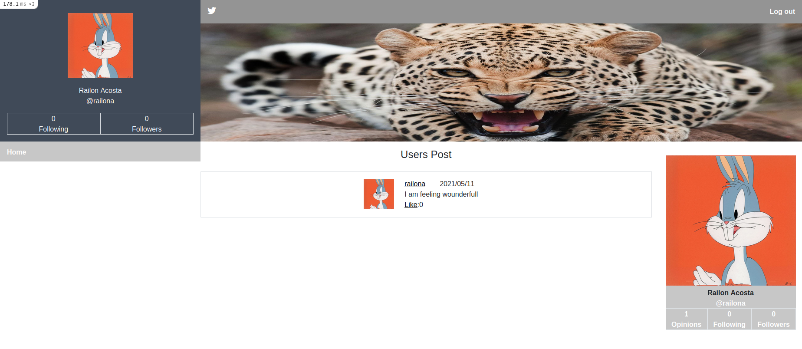

# Twitter Redesign

> In this project I tried to re-create the action flow of the social media website Twitter.

You will be able to sign in, sign up at the home page, post thoughts/opinions, only the users who sign in can see and create an opinion, if you opt to sign out, then you won’t be able to see the opinions at all.
You can upload your profile picture and cover photo.
You can follow other users and see their opinions directly on your home page.


## Built With

- Ruby version 2.7.2
- Ruby on Rails 6.1.3

## Screenshot




## Live preview link

- <https://mytwitterdesign.herokuapp.com/login>

## Getting Started

To get a local copy up and running follow these simple example steps.

## GET STARTED

#### Clone the repository

- Click on the "code" button above on this page and copy the link to the repository
- Run `git clone git@github.com:RailonA/Twitter-redesign.git`
- Go to the cloned repository run `cd twitter-redesign`


#### Install required Gem and Node packages

- In the terminal, run 
    ```
    $ bundle install
    ```
- [optional] Run 
    ```
    $ bundle update
    ```
- Install node packages nun
    ```
    $ yarn install --check-files
    ```

#### Set up the database tables 

- In `./config/database.yml` file, update the username and the password by yours
- Run `rails db:create` and make sure the commande succeded
- Run `rails db:migrate` and make sure the commande succeded

### Usage

1. Run `rails server`
2. Open your browser on <http://localhost:3000/>
3. Enjoy.


## Author

👤 **Railon Acosta**
- GitHub: [@railonA](https://github.com/RailonA)
- Linkedin: [@railonAcosta](https://www.linkedin.com/in/railon-acosta-81265180/)
- Twitter: [@railonAcosta](https://twitter.com/RailonAcosta)


## Contributing

Contributions, issues, and feature requests are welcome!

Feel free to check the [issues pExpress yourself

## Show your support

Give a ⭐️ if you like this project!

## Acknowledgments

Based of the structure from:
[https://www.behance.net/gallery/14286087/Twitter-Redesign-of-UI-details](https://www.behance.net/gallery/14286087/Twitter-Redesign-of-UI-details)

Design idea by [Gregoire Vella on Behance](https://www.behance.net/gregoirevella)

